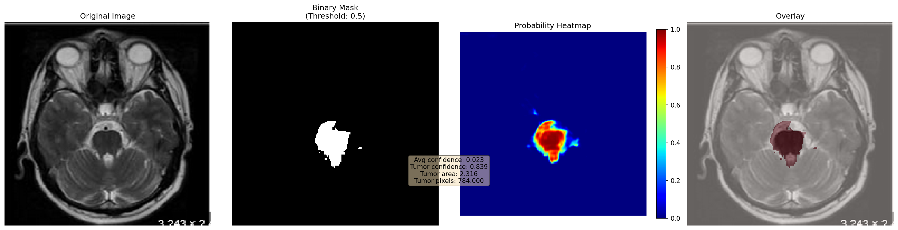

# Brain Tumor Segmentation & Classification Model

## Project Overview

This project implements a comprehensive deep learning solution for brain tumor detection and analysis using MRI images. The model performs two critical tasks:

1. **Tumor Segmentation**: Precisely identifies and segments brain tumor regions in MRI scans using a UNet-based architecture
2. **Tumor Classification**: Classifies detected tumors into four categories:
   - **Glioma**: Aggressive tumor type originating from glial cells
   - **Meningioma**: Tumors arising from the meninges (brain membranes)
   - **Pituitary**: Tumors in the pituitary gland
   - **No Tumor**: Normal, healthy MRI scans

## About the Project

This model leverages state-of-the-art deep learning techniques to assist in medical diagnosis and treatment planning. The dual-task approach (segmentation + classification) provides comprehensive tumor analysis, enabling radiologists and clinicians to make informed decisions quickly and accurately.

### Key Features

- **UNet Architecture**: Encoder-decoder network with skip connections for precise segmentation
- **Binary Cross Entropy Loss**: Optimized for binary segmentation tasks
- **Dice Score Metrics**: Tracks segmentation accuracy with focus on overlap-based evaluation
- **Early Stopping**: Prevents overfitting by monitoring validation metrics
- **GPU Acceleration**: Automatic Mixed Precision (AMP) for faster training on CUDA devices
- **Checkpoint Management**: Saves best models based on Dice score performance

## Model Architecture

The model uses a **UNet** architecture consisting of:

- **Encoder**: Progressive downsampling with convolutional blocks and max pooling
- **Bottleneck**: Dense feature extraction at the lowest resolution
- **Decoder**: Progressive upsampling with skip connections from encoder layers
- **Output Layer**: Sigmoid activation for binary segmentation mask

Training Configuration:

- **Batch Size**: 12
- **Learning Rate**: 0.0001 (Adam optimizer)
- **Epochs**: 50 (with early stopping patience: 10)
- **Loss Function**: BCEWithLogitsLoss
- **Learning Rate Scheduler**: Cosine Annealing

## Results

The model achieves strong segmentation performance with best Dice scores reaching **~0.84** on the validation set.

### Sample Prediction Results:



The overlay visualization shows:

- **Original MRI scan**: Grayscale brain MRI image
- **Ground truth mask**: Original tumor boundary annotations
- **Model prediction**: AI-generated segmentation mask with high accuracy

Training progression shows consistent improvement in Dice coefficient across epochs, demonstrating effective learning and convergence.

## Installation

### 1. Clone the repository

```bash
git clone https://github.com/karthikeyan-kosuri/brain-tumor-model
cd brain-tumor-model
```

### 2. Create a Virtual environment

```bash
python -m venv venv
venv\Scripts\Activate.ps1
```

### 3. Install dependencies

1. CPU-only:

```bash
pip install -r requirements.txt
```

2. CUDA (GPU acceleration):

```bash
# Example: CUDA 12.8 build
pip install torch torchvision --index-url https://download.pytorch.org/whl/cu128
```

## Usage

### Training the Model

```bash
python src/train.py
```

This will:

- Load training and validation datasets
- Train the UNet model with the configured hyperparameters
- Save checkpoints of the best performing models
- Generate training logs and metrics

### Making Predictions

```bash
python src/predict.py
```

This will:

- Load the best trained checkpoint
- Generate segmentation masks for test images
- Create visualization overlays (original + mask + prediction)
- Save predictions to `outputs/results/predictions/`

### Output Artifacts

- **Checkpoints**: `outputs/checkpoints/` - Saved model weights with Dice score and epoch information
- **Predictions**: `outputs/results/predictions/` containing:
  - `masks/` - Binary segmentation masks
  - `overlays/` - Visualization overlays
  - `heatmaps/` - Prediction confidence heatmaps

## Dataset Structure

```
data/
├── segmentation_task/          # MRI images with tumor masks
│   ├── train/
│   │   ├── images/             # Training MRI scans
│   │   └── masks/              # Corresponding tumor masks
│   └── test/
│       ├── images/
│       └── masks/
└── classification_task/        # Pre-classified tumor types
    ├── train/
    │   ├── glioma/
    │   ├── meningioma/
    │   ├── pituitary/
    │   └── no_tumor/
    └── test/
        ├── glioma/
        ├── meningioma/
        ├── pituitary/
        └── no_tumor/
```

## Performance Metrics

The model is evaluated using:

- **Dice Score**: Measures overlap between predicted and ground truth masks (target > 0.8)
- **IoU Score**: Intersection over Union metric for segmentation accuracy
- **Validation Loss**: BCEWithLogitsLoss on validation dataset

Best achieved Dice score: **0.8434** (Epoch 33)

## Technology Stack

- **PyTorch**: Deep learning framework
- **NumPy**: Numerical computations
- **Torchvision**: Image preprocessing and utilities
- **CUDA**: GPU acceleration (optional)
- **Python 3.8+**: Programming language
